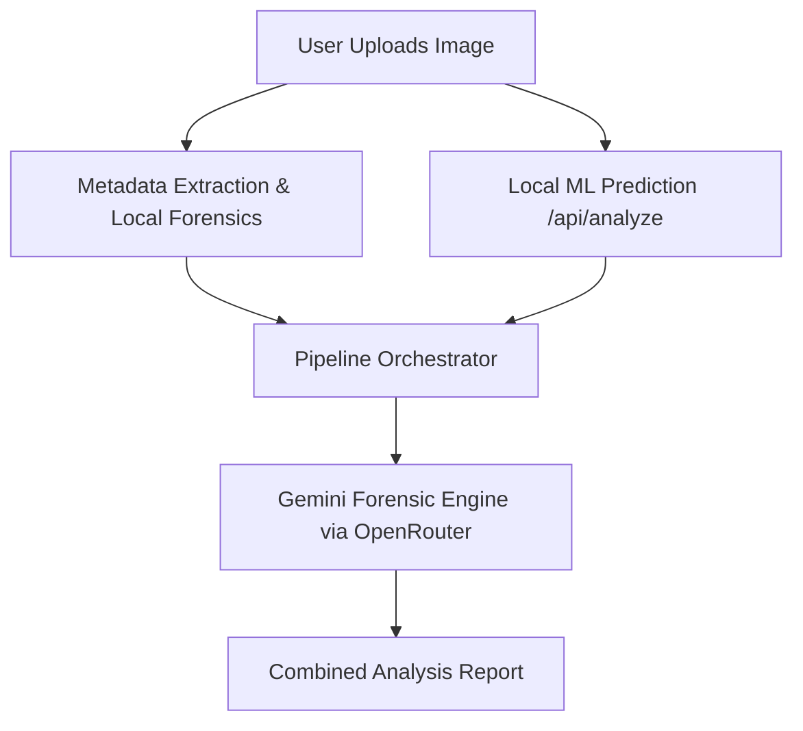
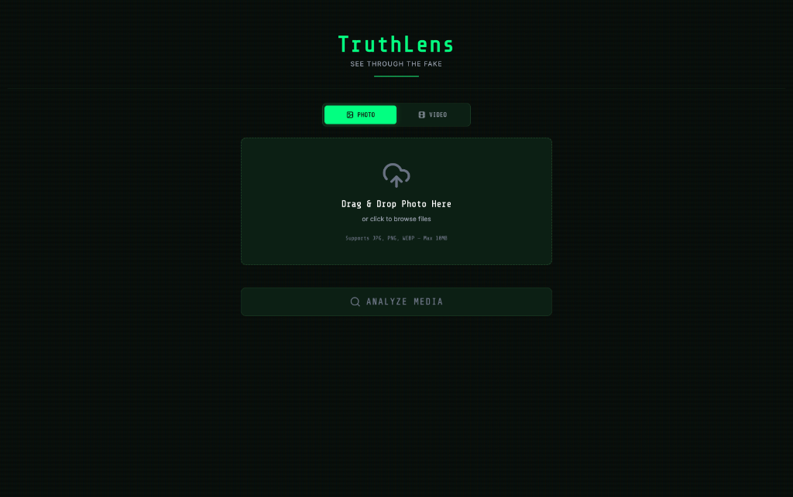

# 🔎 TruthLens AI — Deepfake & Media Authenticity Analysis

TruthLens AI is an advanced, hybrid deepfake detection and media authenticity analysis platform. It combines a fast, local rule-based heuristic and fine-tuned machine learning pipeline with the cognitive power of Large Language Models (Gemini via OpenRouter) to deliver detailed visual forensics and classification.

---

<div align="center">
  <!-- PLACEHOLDER FOR MAIN BANNER -->
  
  <p><i>Empowering journalists, researchers, and users to uncover synthetic media and verified image forensics.</i></p>
</div>

---

## 🌟 Key Features

*   **Hybrid Analysis Pipeline:** Melds local low-latency Machine Learning classifications with high-fidelity Multi-Modal LLM reasoning.
*   **Deep Image Forensics:** Analyzes frequency-domain characteristics, local variance, symmetry anomalies, and compression block boundaries.
*   **Gemini-Powered Explanations:** Feeds predictions and raw visual inputs to Gemini to generate detailed forensic reports.
*   **Explainable AI (XAI):** Built-in support for Grad-CAM heatmaps to visualize where the neural network detects manipulation.
*   **Calibration & Calibration Plots:** Ensures the model's confidence scores reflect real-world probabilities.
*   **Hard Negative Mining:** Automatic extraction and training on challenging edge cases to continually harden the detector.

---

## 📐 Architecture & Pipeline

TruthLens runs a two-step analysis when an image or video frame is uploaded:



### 1. The Heuristic & Local ML Engine
The Express API (`server.ts`) performs high-speed local feature analysis:
*   **Frequency Domain Analysis:** Measures high-frequency versus low-frequency energy ratios to catch typical GAN/Diffusion generator noise.
*   **Local Variance:** Inspects local 8x8 variance patterns for unnatural uniformity.
*   **Edge & Block Artifacts:** Identifies sharp gradient discontinuities and compression block anomalies.
*   **Facial Symmetry:** Checks for subtle anomalies in facial geometry typical of early generative models.

### 2. PyTorch Training Pipeline
A full machine learning stack is included to train a robust classification backbone:
*   **Model Architecture:** Fine-tuned ResNet18 classifier (`model_def.py`).
*   **Training & Calibration:** PyTorch scripts to train on large deepfake datasets (`train_model.py`), followed by temperature scaling (`calibrate_model.py`) to align prediction outputs with true probabilities.
*   **Visual Explanations:** Grad-CAM analysis (`gradcam_analysis.py`) highlights manipulated areas in heatmaps.

---

## 📸 Interface Preview

<div align="center">
  <table>
    <tr>
      <td>
        <!-- PLACEHOLDER FOR WEB APPLICATION UI -->
        
        <br />
        <p align="center"><b>Interactive Upload and Analysis Dashboard</b></p>
      </td>
      <td>
        <!-- PLACEHOLDER FOR ANALYSIS RESULTS -->
        
        <br />
        <p align="center"><b>Forensic Report & Breakdown</b></p>
      </td>
    </tr>
  </table>
</div>

---

## 🚀 Getting Started

### Prerequisites
*   [Node.js](https://nodejs.org/) (v18+ recommended)
*   [Python 3.10+](https://www.python.org/) (For training & model investigation)
*   [PyTorch](https://pytorch.org/) (With MPS/CUDA support for training acceleration)

### Web Application Setup

1.  **Clone the repository and navigate to the project directory:**
    ```bash
    cd TruthLens/TruthLens-main
    ```

2.  **Install dependencies:**
    ```bash
    npm install
    ```

3.  **Setup environment variables:**
    Create a `.env.local` file by copying the example:
    ```bash
    cp .env.example .env.local
    ```
    Configure your Gemini OpenRouter API key in `.env.local`:
    ```env
    VITE_GEMINI_API_KEY="sk-or-v1-your-openrouter-key"
    ```

4.  **Run in development mode:**
    To launch the frontend (Vite) and the backend (Express analysis API) simultaneously:
    ```bash
    npm run dev:all
    ```
    *   **Frontend URL:** `http://localhost:3000`
    *   **Express API URL:** `http://localhost:3001`

---

## 🧠 Machine Learning & Forensics Pipeline

The project includes advanced utilities for model training, testing, and debugging under the `TruthLens-main` directory.

<div align="center">
  <!-- PLACEHOLDER FOR GRAD-CAM & CALIBRATION PLOTS -->
  
  <p><i>Left: Grad-CAM heatmap highlighting facial manipulation. Right: Probability calibration curve.</i></p>
</div>

### Running PyTorch Scripts

*   **Train the model:** Fine-tunes ResNet18 on the manjilkarki deepfake dataset.
    ```bash
    python train_model.py
    ```
*   **Model Calibration:** Calibrates logits using validation data to generate reliable confidence probability scores.
    ```bash
    python calibrate_model.py
    ```
*   **Plot Calibration:** Generates probability curves comparing uncalibrated vs. calibrated model confidence.
    ```bash
    python plot_calibration.py
    ```
*   **Grad-CAM Heatmap Generation:** Inspects the activation mappings on specific test images to visualize model decision-making zones.
    ```bash
    python gradcam_analysis.py --image path/to/image.jpg
    ```
*   **Hard Negative Mining:** Automatically identifies false positives/negatives and logs them for retraining iteration.
    ```bash
    python hard_negative_mining.py
    ```

---

## 🛠️ Tech Stack

*   **Frontend:** React 19, TypeScript, Vite, Tailwind CSS v4, Motion (Animations), Lucide React
*   **Backend:** Express, TypeScript, Sharp (Image processing), Puppeteer, Exifr (EXIF metadata parsing)
*   **AI/ML Core:** PyTorch, Torchvision, NumPy, Scikit-learn, Matplotlib (for plotting calibration metrics), Gemini API (via OpenRouter)

---

## 📜 License

This project is licensed under the MIT License. See the [LICENSE](LICENSE) file for details.
